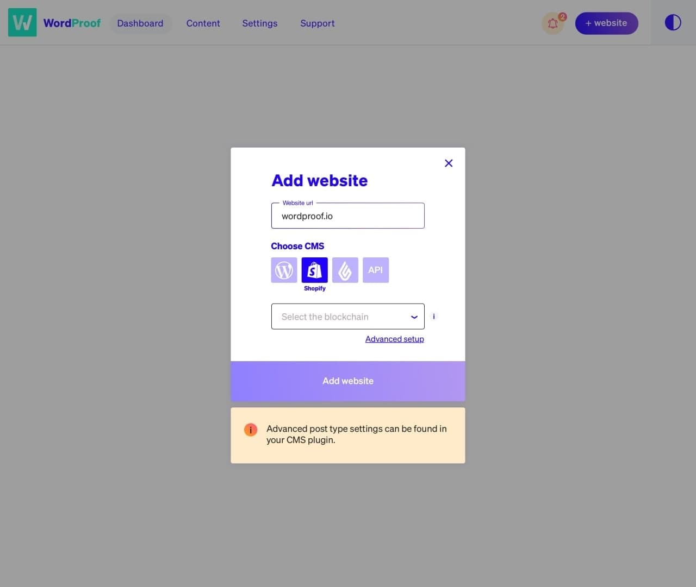

# Test assignment

## Requirements

- Code it as if it was a real project. As you do not have the source file, colors, fonts and sizes don’t have to be pixel perfect but should come close.
- Open the model when clicking on the ‘+ website’ button
- The CMS options are: WordPress, Shopify, Lightspeed, REST API
- The blockchain options are: EOS (recommended), Telos, Ethereum
- When clicking advanced setup, one new input field appears: “Address”

## Mockup

## Final notes

### What has been done

- used Vue.js, TypeScript and TailWind CSS
- created custom reusable components for:
  - notification button including a badge with notifications count
  - text input
  - dropdown
  - CMS icon
  - CMS select
- dashboard view component
- add favicon
- deploy to GitHub Pages [https://vb-oiko.github.io/wordproof-test/](https://vb-oiko.github.io/wordproof-test/)
  
### What has yet to be done if it was a real project

I tried to code as if it was a real project but my strive for perfection is limited by the small amount of time I can devote to the project.

Anyway here is the list of what I think should be done if it was a part of a real project:

- refinement of the requirements for UI and UX with designer and product owner
- creating more reusable components (e.g. for buttons, icons, etc.)
- add support of accessibility standards
- internationalization
- mobile first layout
- form validation and validation feedback for form inputs
- add transitions and animations
- integration with the back end
- unit testing
- e2e testing
- CI/CD